# **Chocolate Customer Dashboard**
Data Pipeline: Excel Power Query (csv) ➜ MySQL Workbench ➜ Power BI Desktop

***Disclaimer: The data is synthetic and designed to simulate real life data analysis for business problem solving***

## **Project Overview**
<p align="justify">
The project analysed customer demographics and products preferences for a global chocolate retailer. The final interactive dashboard provide actionable insights to support data-driven decision-making for marketing stategies and regional growth.
</p>

## **Business Objectives**

* Identify customers' purchase behaviour and demographic trends.
* Analyze top-performing chococolate by using DAX ranking measure.
* Track the potential growth opportunities across global cities based on revenue.
---

## **Methodology**
Before we straight into the process of creating dashboard, here is the final dashboard preview......

### **Preview of Interactive Dashboard**
<p align="center">
  
  <br>
</p>

### **Excel**
The raw dataset was sourced from [Kaggle](https://www.kaggle.com/datasets/ssssws/chocolate-sales-dataset-2023-2024/data) and imported into Power Query to perform data quality assessments and initial preprocessing.
<p align="center">
  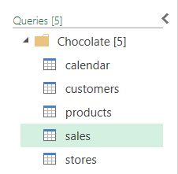
  <br>
</p>

Here is the found data error:
1. The country and city values under stores table did not align. (Assuming that the cities mapped to the incorrect country)
<p align="center">
  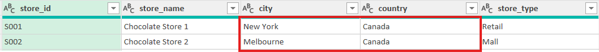
  <br>
</p>

The process of **preprocessing** applied in the power query are:

#### **Stores**
1. Removed the **country** column. Recreated the **country** column by using custom columns.
```powerquery
  = Table.AddColumn(#"Filtered Rows", "country_name", each if [city] = "New York" then "USA"
    else if [city]="Melbourne" then "Australia"
    else if [city]="Berlin" then "Germany"
    else if [city]="London" then "UK"
    else if [city]="Paris" then "France"
    else if [city]="Sydney" then "Australia"
    else if [city]="Toronto" then "Canada"
    else "Other")
```
#### **Calendar**
1. Added **Month Name**, **Day Name** and **Week of Year**
2. Modified the **date** format from _"yyyy-mm-dd"_ into _"mm/dd/yyyy"_ (SQL date format)

#### **Customers**
1. Created the **loyalty_members?** by using custom columns to convert binary into "Yes" or "No". Then removed **loyalty_member**.
```powerquery
= Table.AddColumn(#"Changed Type", "loyalty_member?",
  each if [loyalty_member]=1 then "Yes"
  else "No")
```
2. Created **age_category** column by using custom column for categorized **age** into four different categories.

```powerquery
= Table.AddColumn(#"Removed Columns", "age_category", each if [age] <= 25 then "1. Young Adult (18-25)"
  else if [age] <= 40 then "2. Adult (26-40)"
  else if [age] <= 60 then "3. Middle-Aged (41-60)"
  else "4. Senior Citizen (61+)")
```
3. Modified the **join_date** format from _"yyyy-mm-dd_" into _"mm/dd/yyyy"_ (SQL date format)

#### **Products**
1. Created full_product_name column to combine product_name, brand, category and weight_g
      **Format**: > *"brand" "product_name" ("category") - "weighted_g"g*
```powerquery
= Table.AddColumn(#"Filtered Rows", "full_product_name", each [brand]&" "& [product_name]&"
  ("&[category]&") - "& Text.From([weight_g]) & "g")
```

#### **Sales**
1. Modified the **order_date** format from _"yyyy-mm-dd_" into _"mm/dd/yyyy"_ (SQL date format)

After preprocessing were done, every table or sheet was then converted to .csv file. These csv file will be imported into MySQL 8.0 Workbench CE for further data analysis.

---

### **MySQL**

<p align="justify">
I created a schema named retail_chocolate_syn in MySQL database. Then, I created tables for importing data from csv files into MySQL under <i>retail_chocolate_syn</i> schema. There is an additional table named country_metadata which functioned as dynamic flag feature which will covered in PowerBI section later. 
</p>

#### Example of creating table using SQL:
```sql
    CREATE TABLE sales (
        order_id VARCHAR(50),
        order_date DATE,
        product_id VARCHAR(50),
        store_id VARCHAR(50),
        customer_id VARCHAR(50),
        quantity INT,
        unit_price DECIMAL(10,2),
        discount DECIMAL(10,2),
        revenue DECIMAL(10,2),
        cost DECIMAL(10,2),
        profit DECIMAL(10,2)
    );
```
The outcome of successful creating table under schema:
<p align="center">
  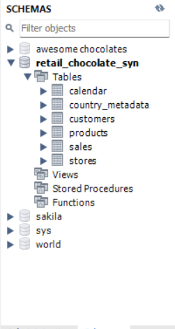
  <br>
</p>

#### Data Format used in SQL
These are the data format used while creating the table.
| Data Type | Description |
| :--- | :--- |
| DATE | Date format of _"mm/dd/yyyy"_|
| DECIMAL(_P,S_) | Decimal value where _P_ is total number of digits and _S_ is decimal point |
| INT | Whole number |
| VARCHAR(_L_) | Variable Character where _L_ is maximum length of string|

After tables were created, the csv files are required to copy into `C:\\ProgramData\\MySQL\\MySQL Server 8.0\\Uploads` directory for importing data into MySQL database.

#### Example of importing data into the schema using SQL:
```sql
    LOAD DATA INFILE "C:\\ProgramData\\MySQL\\MySQL Server 8.0\\Uploads\\sales.csv"
    INTO TABLE sales
    FIELDS TERMINATED BY ',' 
    ENCLOSED BY '"'
    LINES TERMINATED BY '\r\n'
    IGNORE 1 ROWS;
```
We can check whether the data were sucessfully imported into MySQL database by using this SQL Query:
```sql
  SELECT *
  FROM retail_chocolate_syn.table_name; # Change table_name according to which table you like to check for
```

The example of success data imported in MySQL:
<p align="center">
  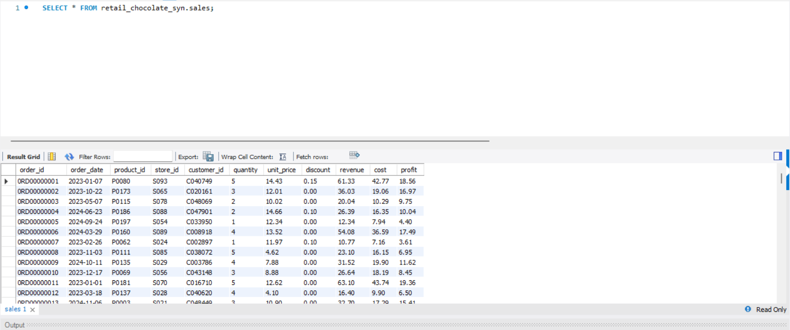
  <br>
</p>

The rest sql code for creating table and importing data were available in [**SQL Query**](./SQL%20Query/) directory.

#### Data Analysis
These are the insights I found while using MySQL:
1. There is no significant different in verage revenue and average profit between loyalty members and non-members across all age groups. This implies that the current loyalty program is not driving higher spending per transaction.

<p align="center">
  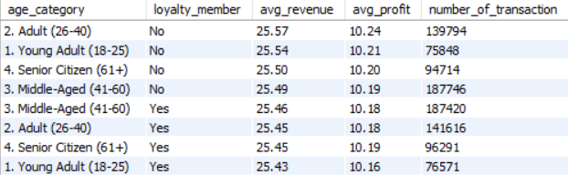
  <br>
</p>

2. The overall customers are from Middle-Aged (41-60) and Adults (26-40) while Senior Citizens (61+) exhibit the highest transaction per customer (TPC). The senior citizens are the most frequent buyers, proving to be loyal although they consist lesser volume in the customer base.

<p align="center">
  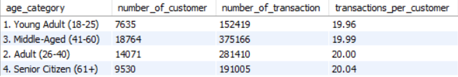
  <br>
</p>

3. The distribution follow the same overall distribution stated in analysis no. 2 and remained consitent across all cities. Toronto shows the highest TPC across all age groups, indicated that the city have higher potential for further marketing event or expansion.

For Australia and Canada country (Top 12 rows views): 
<p align="center">
  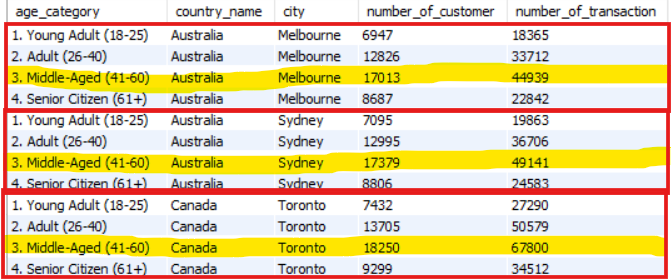
  <br>
</p>
Top TPC fall in Canada (Top 10 row views):
<p align="center">
  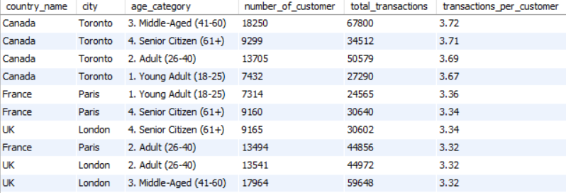
  <br>
</p>

4. The prefered shopping mode across all customers' age group are airport. This shows that customer like to purchase chocolate before taking flight or after arrival for snacks or last minute gift.

<p align="center">
  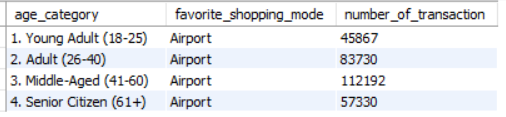
  <br>
</p>

5. 'Mars Milk Chocolate 50% (Praline) - 80g', 'Cadbury Dark Chocolate 70% (Praline) - 100g' and 'Lindt Milk Chocolate 60% (Milk) - 100g' consistently rank in the top 3 favourite across age group based on their total revenue.

<p align="center">
  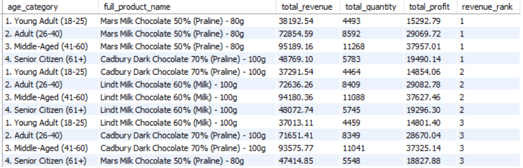
  <br>
</p>

The executed SQL query were explained according the numbering under data analysis section. Here is the [link](./SQL%20Query/Explained%20Customer%20Analysis.sql) to the sql file.

---

### **Power BI**
The data were imported from MySQL database to create interactive PowerBI dashboard. This allow the data refresh when there is any change or update in the corresponding table in MySQL.

`Get Data` (in **Data** ribbon under **Home** tab) > `More...` > `MySQL database`

#### Data Modelling (Star Schema)
* Fact Table (Center): Sales
* Dimension Table: Customers, Products, Stores, Calendar
* Extra Table: Country Metadata

<p align="center">
  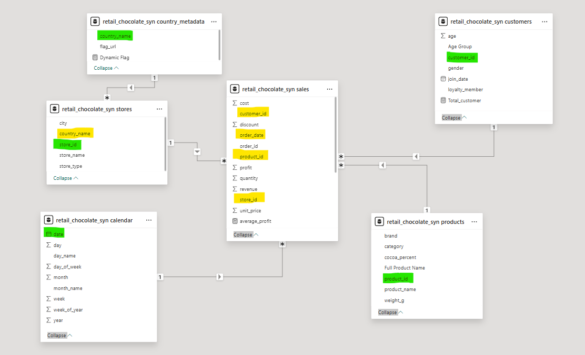
  <br>
</p>

_yellow = foreign key_

_green = unique key_

| Table Relationship | Direction | 
| :--- | :--- |
| **Customers** (_customer_id_) ➜ **Sales** (_customer_id_) | one to many ( _1 : *_ )|
| **Products** (_product_id_) ➜ **Sales** (_product_id_) | one to many ( _1 : *_ ) |
| **Calendar** (_date_) ➜ **Sales** (_order_date_) | one to many ( _1 : *_ ) |
| **Stores** (_store_id_) ➜ **Sales** (_store_id_) | one to many ( _1 : *_ )|
| **Country** _Metadata_ (country_name) ➜ **Stores** (_country_name_) | one to many ( _1 : *_ )|

#### Dashboard Layout
The interactive dashboard consists of 4 different metric card, a dynamic flag indicator, city slicer with button, 5 different chart in the main body.

<p align="center">
  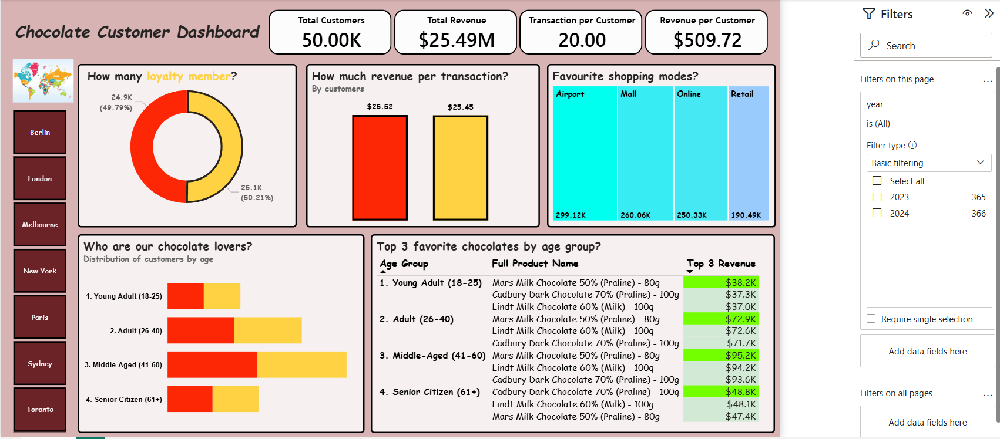
  <br>
</p>

##### Card

Here are the 4 measures used in the card visuals.

```sql
Total Customers = DISTINCTCOUNT('retail_chocolate_syn sales'[customer_id])
// DISTINCTCOUNT() = does not include duplicate count
```
```sql
total_revenue = SUM('retail_chocolate_syn sales'[revenue])
```
```sql
TPC = DIVIDE(COUNT('retail_chocolate_syn sales'[order_id]),Total Customers,0)
// DIVIDE(X,Y,Z) = X Divide Y, Z if error
```
```sql
RPC = DIVIDE([total_revenue],Total Customers,0)
```

| Card Metric | Description |
| :--- | :--- |
| **Total Customers** | Unique customer count between _2023-2024_|
| **Total Revenue** | Gross sales between _2023-2024_|
| **Transaction per Customer (TPC)** | _Purchase frequency index_; measures how often customers buys between _2023-2024_|
| **Revenue per Customer (RPC)**| _Customer Lifetime Value (CLV)_; measure average spending per customer between  _2023-2024_|

<p align="center">
  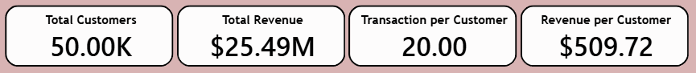
  <br>
</p>

##### Slicer + Dynamic Flag Indicator

The city slicer with tiles were used. The dynamic flag indicator located on top of the city slicer. This indicator was made by multi-row card with field of a Dax measure named Dynamic Flag.

```sql
Dynamic Flag = 
IF(
    HASONEVALUE('retail_chocolate_syn stores'[country_name]),
    /* HASONEVALUE() return true when country were filtered down only one distinct country by city slicer*/

    LOOKUPVALUE('retail_chocolate_syn country_metadata'[flag_url],
    'retail_chocolate_syn country_metadata'[country_name],
    VALUES('retail_chocolate_syn stores'[country_name])),
    /* LOOKUPVALUE(X,Y,Z) search flag_url (X), by matching country name (Y) value in the same table as X with country name (Z) from another table.
     VALUES() used to convert filtered column into a list.*/

    "https://www.worldmap1.com/map/world/amp/world_map_with_countries.jpg"
    /* Display global map as default if no specific city filter is applied */
)
```

The indicator will show corresponding country flag based on city filtered using slicer. For example, Canada flag will show up if Toronto was selected in the slicer. However, if there is no city or more than two cities were filtered, it will returned a global map as the indicator.

<p align="center">
  
  <br>
</p>

##### Main Body (Chart)
_The dashboard highlight the relationship between loyalty programs, demographics, and purchasing patterns._

1. **How many loyalty member?** (_Donut chart_)
* **Purpose**: Visualizes the **distribution** of customers between **loyalty members** (_Yellow_) and **non members** (_Red_). This serves as a baseline for understanding the reach of the current membership program.
2. **How much revenue per transaction?** (_Vertical Bar Chart_)
* **Purpose**: Compares the **Average Transaction Value** (_ATV_) between member types. It highlights whether loyalty programs successfully drive higher spending per transaction or remains consistent across member types.
3. **Favourite Shopping modes?** (_Tree Map_)
* **Purpose**: Displays the **hierarchy of shopping modes**. The visual helps to identify customer preferences, allowing for targeted marketing strategies on the most effective shopping platforms.
4. **Who are our chocolate lovers?** (_Horizontal stack bar Chart)_
* **Purpose**: Categorise customer base into **four age categories**, and further segmented by **loyalty status**. This identifies which age group has the highest engagement with the brand and the loyalty program.
5. **Top 3 favorite chocolates by age group?** (_Matrix_)
* **Purpose**: Determine the **highest-revenue chocolate products** across different age group. This matrix reveals specific product preferences within age groups, enabling targeted marketing and inventory optimization.
* The measure for Top 3 Revenue:
```sql
Top 3 Revenue = 
VAR ProductRank = 
    IF(
        ISINSCOPE('retail_chocolate_syn products'[Full Product Name]),
        RANKX(
            CALCULATETABLE(
                VALUES('retail_chocolate_syn products'[Full Product Name]),
                ALLSELECTED('retail_chocolate_syn products'[Full Product Name])
            ),
            [total_revenue],
            ,
            DESC,
            Dense
        ),
        BLANK()
    )
RETURN
IF(ProductRank <= 3, [total_revenue], BLANK())
```
Here are the explanation of DAX expression works:
| Dax Expression | Parameter(s) | Description |
| :--- | :--- | :--- |
| **VAR** | _VAR X_ | Create variable "_X_" with measure so it can be reused in final calculation. |
| **ISINSCOPE** | _ISINSCOPE(X)_ | Return True if _X_ is current level in the matrix. |
| **RANKX** | _RANKX(W,X,<value>,Y,Z_) | Determine the ranking of W based on _X_ in _Y_ (**ASD or DESC**) order. If happen to be ties, use _Z_ as tiebreaker.|
| **CALCULATETABLE**| _CALCULATETABLE(X,Y)_ | Create Table from _X_ filtered by _Y_. |
| **VALUES**| _VALUES(X)_ | Convert _X_ column into as list. |
| **ALLSELECTED**| _ALLSELECTED(X)_ | Return **all** values in _X_ **ignore internal filter** but **preserve external slicer filters**. |

The measure of _Top Rank Colour_ (for better focus) that applied in background colour under _Top 3 Revenue_:
```sql
Top Rank Colour = 
VAR ProductRank = 
    RANKX(
        CALCULATETABLE(
            VALUES('retail_chocolate_syn products'[Full Product Name]),
            ALLSELECTED('retail_chocolate_syn products'[Full Product Name])
        ),
        [Top 3 Revenue],
        ,
        DESC, Dense
    )
RETURN
    IF(
        ProductRank = 1 && [Top 3 Revenue] > 0, 
        "#73FF00", //Bright Green
        "#D2E9D6" //Pale Bright Green
    )
```
#### Troubleshooting and the solution on matrix table
Problem: Found out that there the rank 1 product name shows blank.

<p align="center">
  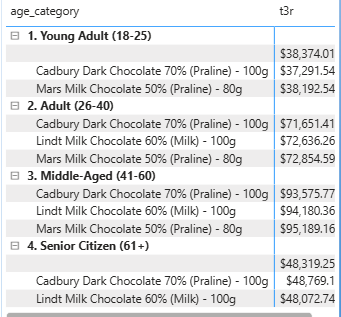
</p>

---

Cause: 
* This is due to missing entry of **P0000** and **P0201** _product_id_ in _products table_ (**dimension**).
* It will return as blank even there is record of **P0000** and **P0201** in _sales table_ (**fact**).

Solution:
* Add record of **P0000** and **P0201** as unknown promotion in MySQL server and refresh in PowerBI. The data will updated automatically and reflected on the interactive dashboard.
* Use this sql query to add the record:
```sql
INSERT INTO 
  products (product_id, product_name, brand, category, cocoa_percent, weight_g, full_product_name)
VALUES 
	('P0000', 'Unknown Product (P001)', 'Unknown', 'Unknown', 0, 0, 'Unknown Product (P001)'),
	('P0201', 'Unknown Product (P002)', 'Unknown', 'Unknown', 0, 0, 'Unknown Product (P002)')
```

Here is the overview of main body of the dashboard:
<p align="center">
  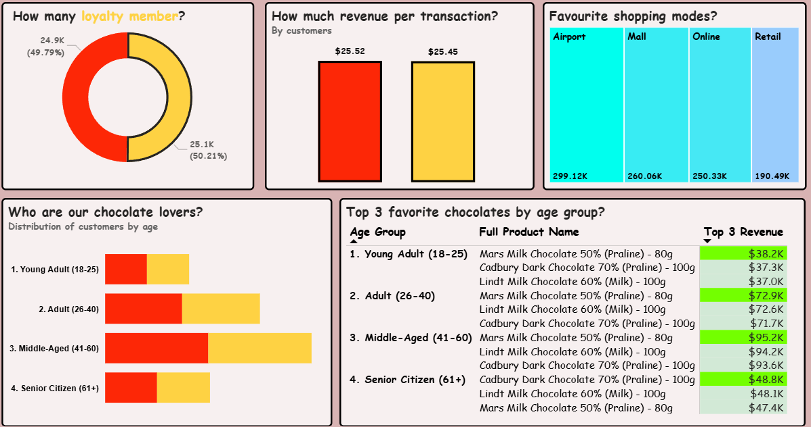
  <br>
</p>

---

#### Buisness Insights

---

## **Directories**
* [***/Dashboard***](./Dashboard/): Contains the final dashboard .pbix file.
* [***/SQL Query***](./SQL%20Query/): Includes .sql scripts for table creation and data analysis.
* [***/media***](./media/): Contains screenshots and the interactive GIF demo.
* [***/data***](./data/): Contains [***cleaned data***](./data/cleaneddata/) and [***Excel Power Query***](./data/Chocolate%20Power%20Query.xlsx) that merge from [***raw data***](./data/rawdata/). 
* **LICENSE**: MIT License for open-source transparency.
